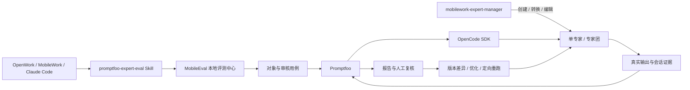

# MobileEval 专家评测中心

<p align="center">
  
  &nbsp;&nbsp;&nbsp;
  
</p>

<p align="center">
  面向 MobileWork / OpenWork 的专家与专家团评测、复核、对照和优化闭环。
</p>

MobileEval 以 **OpenWork 对话**为用户入口，通过 **Promptfoo `opencode:sdk`**
驱动真实 OpenCode 单专家或专家团执行任务，并在本地评测中心统一管理对象、用例、模型、运行、
证据、人工结论、版本差异与优化复测。

> **安装即可使用，无需额外部署 Docker、数据库或独立后端服务。**
> Skill 内已包含前端、后端、运行脚本和本地 SQLite 数据库初始化逻辑。新机器准备好
> Python 3.10+、Node.js 18+ 与评测模型 API Key 后，首次启动会自动补齐其余项目依赖。

## 项目定位

这不是只输出一个分数的测试脚本，而是一套面向智能体的本地评测与优化工作台：

- **真实执行**：每个 case 启动独立 OpenCode 会话，由单专家或专家团真实完成任务。
- **人在回路**：自动断言、LLM Rubric 与人工复核可以共同形成最终结论。
- **过程可追溯**：保留提示词、输出、断言、错误、主/子会话、过程事件和运行产物。
- **版本可比较**：支持专家版本、模型、是否启用专家、重复次数等受控变量对照。
- **优化可回归**：根据失败 case 和人工意见生成建议，查看版本差异后用同批 case 复测。
- **本地优先**：页面、数据与凭据管理均在本机完成，API Key 只做掩码展示。

## 整体架构



两项 Skill 各司其职：

- `promptfoo-expert-eval`：负责对象导入、case、真实评测、报告、复核、对照和回归。
- `mobilework-expert-manager`：负责创建、转换、编辑和校验标准 OpenCode 专家包；完成后可直接进入评测流程。

## 六步完成一次专家评测

| 步骤 | 用户操作 | 系统结果 |
|---|---|---|
| 1. 导入对象 | 上传专家/专家团文件夹或 ZIP，或填写服务器路径 | 识别 single/team、角色、来源和隔离工作区 |
| 2. 准备用例 | AI 生成、外部导入或人工编辑 case，并完成审核 | 只有 `approved` case 进入正式运行 |
| 3. 配置模型 | 填写 provider、model、Base URL、API Key 与单价，并测试连接 | 开跑前确认端点、凭据和模型可用 |
| 4. 发起评测 | 选择对象版本、模型、repeat、concurrency 和运行模式 | Promptfoo 驱动真实 OpenCode 会话执行每个 case |
| 5. 查看报告 | 先看总览，再下钻逐 case 输出、断言和会话证据 | 获得状态、得分、耗时、token、费用和错误详情 |
| 6. 复核优化 | 人工判定、失败定向重跑、查看版本 diff 并同批复测 | 形成“发现问题 → 修改 → 对照 → 回归”的闭环 |

## 已实现功能

### 1. 专家与专家团对象管理

- 统一管理单专家和专家团，展示类型、角色、成员、来源与版本。
- 支持上传文件夹、ZIP、服务器路径以及从 OpenCode/OpenWork 工作区导入。
- 为评测对象创建隔离工作区，原始专家包保持只读。
- 可桥接 `mobilework-expert-manager` 创建、转换或编辑标准专家包。

### 2. 评测用例生成、导入与审核

- 两阶段 AI 生成：先生成概要供确认，再生成完整 case。
- 支持 JSON、YAML、Markdown、Excel 等外部材料的语义转换与导入。
- 支持逐条查看、编辑、通过、驳回、删除和批量审核。
- case 可组合文本、正则、JavaScript、工具调用、委派、知识命中与 LLM Rubric 等断言。

### 3. 模型与费用管理

- 保存模型名称、provider、model id、Base URL、API Key 和默认模型。
- 正式运行前可执行最小请求测试连接，并直接显示网络或接口错误。
- 配置输入/输出 token 单价后，在报告中提供费用估算。

### 4. Promptfoo + OpenCode 真实评测

- 使用 Promptfoo `opencode:sdk` provider 启动真实 OpenCode 会话。
- 支持专家版本、模型、启用/不启用专家、重复次数、并发度和实验变量。
- 每次运行使用独立目录和数据环境，避免并行会话相互污染。
- 超时、崩溃、空输出与断言失败分别记录，不把基础设施异常误算为通过。

### 5. 分层报告与原始证据

- 总览运行状态、得分、通过/失败/异常数量、耗时、token 和费用。
- 展示模块级、基准级和逐 case 指标；专家团额外展示协同与成员过程。
- 下钻查看模型输出、断言明细、错误、主/子会话、工具事件和过程 trace。
- 支持历史趋势、运行对比与原始结果导出。

### 6. 人工复核与 AI 建议

- 支持逐 case 和批量判定通过/失败，保留综合评分、自定义指标与备注。
- 已有人工结论不会被批量操作静默覆盖。
- 人工意见和运行证据可以继续进入 AI 优化建议，而不是停留在展示层。

### 7. 对照实验与稳定性分析

- 对比不同专家版本、不同模型以及启用/不启用专家的结果。
- 支持多次独立重复运行、分数趋势、两次运行逐 case 对比。
- 清晰标记回归、改进、一致通过、一致失败和异常/无数据。

### 8. 版本、优化与回归闭环

- 优化或切换前自动保存版本快照。
- 支持历史版本列表、文件级 diff、恢复历史版本和生成优化版本。
- 可一键仅重跑失败/异常 case，沿用原运行变量，减少时间和模型费用。
- 长任务完成后可通过浏览器通知和标题闪烁提醒用户。

## 快速开始

### 基础环境

| 依赖 | 要求 | 用途 |
|---|---|---|
| Python | 3.10+ | 本地后端、数据库与评测控制脚本 |
| Node.js / npm | 18+ | 前端构建及 Promptfoo/OpenCode 运行链路 |
| 模型 API Key | 按所选 provider | case 生成、真实评测和分析建议 |

不需要预先安装 Docker，也不需要手工部署数据库或单独启动多个服务。
`mobileeval_ctl.py start` 会初始化 `~/MobileEval`、创建本地 SQLite 数据库，并在需要时补齐
Flask、Promptfoo、OpenCode CLI 与前端依赖。

### OpenWork 安装

1. 打开 `Settings → Extensions → Install from GitHub`。
2. 输入：`https://github.com/Prado-learning/MobileWork-Expert-Evaluator`。
3. 依次选择 `Preview → Install → Refresh`。
4. 新建对话，直接说“打开 MobileEval 评测中心”或“评测这个专家团”。

### Claude Code Marketplace 安装

```text
/plugin marketplace add Prado-learning/MobileWork-Expert-Evaluator
/plugin install promptfoo-expert-eval@mobilework-expert-eval-marketplace
/reload-plugins
```

### 从源码启动

```bash
python skills/promptfoo-expert-eval/scripts/mobileeval_ctl.py start
```

启动成功后访问：<http://127.0.0.1:7891>

首次进入先在“评测模型”页面添加模型并点击“测试连接”，随后即可导入对象、审核 case 和发起评测。

## 命令行兼容入口

网页是推荐入口；需要自动化或调试时，也可以直接使用 Skill 脚本：

```bash
# 查看对象与 case
python skills/promptfoo-expert-eval/scripts/expert_tools.py list-objects

# 预览一次评测参数，不创建 run
python skills/promptfoo-expert-eval/scripts/mobileeval_ctl.py run-eval \
  --object-id=1 --dry-run

# 运行器内置 case 列表
python skills/promptfoo-expert-eval/scripts/run_eval.py \
  --working-dir=<评测工作区> --list
```

正式运行前建议先执行 dry-run，确认对象版本、模型、repeat、concurrency 与 case 范围。

## 数据与证据

默认运行目录为 `~/MobileEval`：

```text
~/MobileEval/
├── eval-data/
│   ├── mobileeval.db        # 对象、case、模型、运行、复核、建议与版本记录
│   ├── runs/                # 每次评测的配置、输出、日志和过程证据
│   └── artifacts/           # 上传与导出产物
├── backend/                 # 本地 Flask 后端
└── frontend/                # 本地评测中心页面
```

每次评测还会保留 Promptfoo 配置、`results.json`、`summary.json`、输出文本、日志与会话证据，
用于复核、问题定位和同批 case 回归。

## 项目结构

```text
MobileWork-Expert-Evaluator/
├── .claude-plugin/                  # 插件与 Marketplace 清单
├── skills/
│   ├── promptfoo-expert-eval/
│   │   ├── SKILL.md                 # 对话式评测工作流
│   │   ├── scripts/                 # 启动、对象、case 与真实评测脚本
│   │   ├── cases/                   # 默认 case 库
│   │   ├── references/              # case 结构与评测方法说明
│   │   └── mobileeval/
│   │       ├── backend/             # Flask API、SQLite 与评测引擎
│   │       └── frontend/            # React 本地评测中心
│   └── mobilework-expert-manager/   # 专家/专家团创建、转换、编辑与校验能力
├── docs/                             # 教程、品牌与示意素材
├── tests/                            # 插件、接口与页面验证
└── README.md
```

## 安全边界

- 被测原始专家包保持只读，评测和优化都在隔离工作区进行。
- 文件浏览与用户可控路径限制在评测数据目录和已登记工作区内。
- 默认服务只监听 `127.0.0.1:7891`，不对公网开放。
- API Key 在页面中掩码显示；导出或共享证据前仍应再次检查并脱敏。
- 正式评测会真实调用模型并产生费用，请先测试连接并确认运行次数和并发度。
- Mock、缓存复用、预制输出或证据缺失不应计入真实有效运行。

## 项目资料

- [项目仓库](https://github.com/Prado-learning/MobileWork-Expert-Evaluator)
- [Promptfoo 评测 OpenCode 专家团教程](docs/promptfoo-eval-tutorial.html)
- [团队每周工作记录（飞书）](https://my.feishu.cn/sheets/X173slUx9hnPNPtZWaOcJG6BncI?from=from_copylink)
- [课题任务书（腾讯文档）](https://docs.qq.com/doc/DRXVNTktmaFZ2Wmpy)
- [课题任务说明网页](http://60.205.90.182/mobilework-expert-evaluation-brief/)

## License

[Apache-2.0](https://www.apache.org/licenses/LICENSE-2.0)
